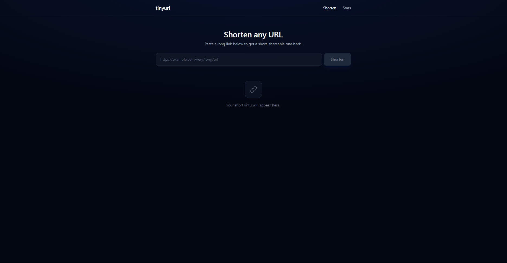
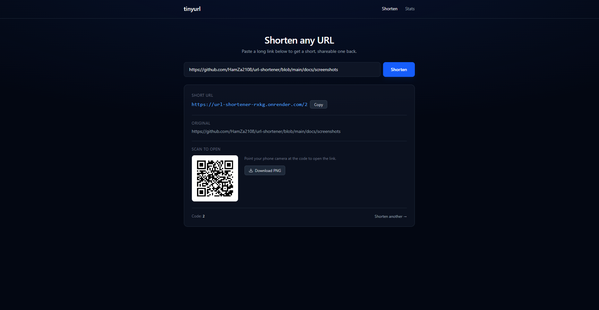
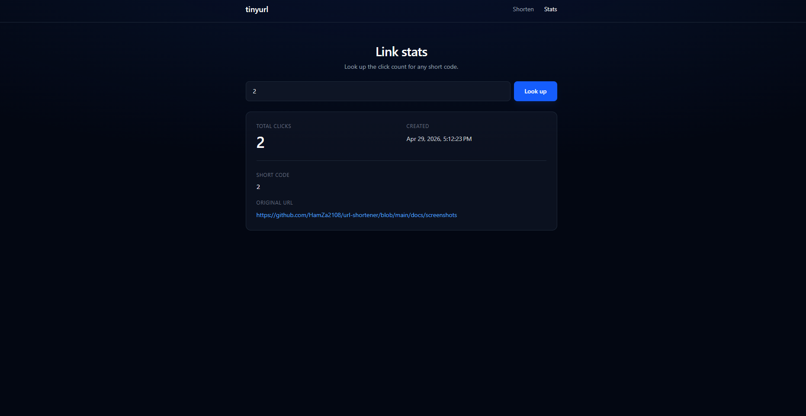

# URL Shortener

A minimalist full-stack URL shortener with click tracking and QR code generation — built end-to-end in a single day to demonstrate clean architecture across Java, Spring Boot, and Angular.

[](https://url-shortener-web-ewyz.onrender.com)
[](https://url-shortener-rxkg.onrender.com)
[](https://spring.io/projects/spring-boot)
[](https://angular.dev)

## Live Demo

- **Web app:** https://url-shortener-web-ewyz.onrender.com
- **API:** https://url-shortener-rxkg.onrender.com

> First request after a few minutes of idle may take ~30 seconds — Render's free tier spins down inactive services.

## Screenshots

| | |
|---|---|
|  |  |
| Empty state with branded header | Shortened result with QR code |

| |
|---|
|  |
| Per-link click stats lookup |

## Stack

| Layer    | Technology                                              |
| -------- | ------------------------------------------------------- |
| Backend  | Java 17 · Spring Boot 4 · Spring Data JPA · Hibernate   |
| Database | PostgreSQL (production) · H2 in-memory (development)    |
| Frontend | Angular 21 (standalone, zoneless, signals)              |
| Styling  | Tailwind CSS v4                                         |
| Hosting  | Render (free tier) · Containerized with Docker          |

## Features

- **Short URLs** generated using Base62 encoding of auto-incrementing database IDs (collision-free, no random retries)
- **Click tracking** with per-link counter incremented on each redirect
- **Stats lookup endpoint** exposing click count and creation timestamp
- **QR code generation** for each short link with one-click PNG download
- **Reactive form validation** with inline error messages
- **Copy-to-clipboard** with feedback state
- **Configurable CORS** for safe cross-origin deployment
- **Environment-based API URL switching** (dev vs production)
- **JVM-tuned Docker image** for low-memory deployment (runs on Render's 512 MB free tier)
- **Branded UI** with custom favicon, dark theme, and subtle entrance animations
- **Smart short-link parsing** on the stats page — paste either a full short URL or just the code, the frontend extracts it automatically

## API Reference

| Method | Endpoint                  | Description                                            |
| ------ | ------------------------- | ------------------------------------------------------ |
| `POST` | `/api/shorten`            | Create a short link from a long URL                    |
| `GET`  | `/{shortCode}`            | Redirect to the original URL and increment its counter |
| `GET`  | `/api/stats/{shortCode}`  | Return click count and metadata for a short code       |

### Example

```bash
curl -X POST https://url-shortener-rxkg.onrender.com/api/shorten \
  -H "Content-Type: application/json" \
  -d '{"url": "https://github.com"}'
```

```json
{
  "shortCode": "1",
  "shortUrl": "https://url-shortener-rxkg.onrender.com/1",
  "longUrl": "https://github.com"
}
```

## Architecture Notes

- **Base62 encoding** turns each row's primary key into a short, unique code (`1` → `"1"`, `100000` → `"q0U"`). Eliminates the need for collision-checking loops or pre-allocated key pools.
- **Two-phase save** in `UrlShortenerService`: insert the row to obtain the auto-generated ID, then update the row with the encoded short code. Trades one extra `UPDATE` for guaranteed correctness with `IDENTITY` ID generation.
- **Profile-based config** in `application.yml`: H2 in-memory for local development, PostgreSQL for production via Spring profiles.
- **Zoneless change detection** on the frontend uses Angular Signals for state — no Zone.js polyfill, smaller bundle, faster runtime.
- **Multi-stage Dockerfile** with JDK for build, JRE-only for runtime — smaller image, faster cold starts.
- **JVM-tuned for small containers**: Serial GC, capped heap percentage, reduced thread stack, disabled JMX. Standard production tuning for 512 MB-class deployments.
- **Frontend QR generation** keeps load off the backend — codes are computed in the browser via the `qrcode` library and rendered as PNG data URLs.

## Run Locally

### Prerequisites

- JDK 17+
- Node.js 20+
- Maven (or use the included `./mvnw` wrapper)

### Backend

```bash
cd url-shortener-backend
./mvnw spring-boot:run
```

API available at `http://localhost:8080`.

### Frontend

```bash
cd url-shortener-frontend
npm install
ng serve
```

App available at `http://localhost:4200`.

## Project Structure

```
url-shortener/
├── url-shortener-backend/         Spring Boot backend
│   ├── src/main/java/com/hamzazine/urlshortener/
│   │   ├── controller/            REST endpoints
│   │   ├── service/               Business logic and Base62 encoder
│   │   ├── entity/                JPA entities
│   │   ├── repository/            Spring Data repositories
│   │   ├── dto/                   Request/response records
│   │   ├── exception/             Domain errors and global handler
│   │   └── config/                CORS configuration
│   ├── Dockerfile                 Multi-stage build with JVM tuning
│   └── src/main/resources/application.yml
└── url-shortener-frontend/        Angular frontend
    └── src/app/
        ├── components/shortener/  URL submission, QR generation, copy
        ├── components/stats/      Click stats lookup
        └── services/              API client
```

## Deployment

Both services are deployed on Render's free tier:

- **Backend**: Web Service (Docker), connects to a managed PostgreSQL instance.
- **Frontend**: Static Site (built with `ng build`, served from `dist/.../browser`).
- **Routing**: SPA fallback via `_redirects` so deep links to `/stats` resolve correctly.

## Possible Improvements

- Custom alias support (let users choose their own short code)
- Link expiration timestamps
- Click analytics chart (clicks over time)
- Rate limiting per IP at the redirect endpoint
- API key authentication for the shorten endpoint
- Migration from H2 to Testcontainers for integration tests
- Recent links history (using `localStorage` on the client)

## Author

Built by [Hamza Zine](https://github.com/HamZa2108).
